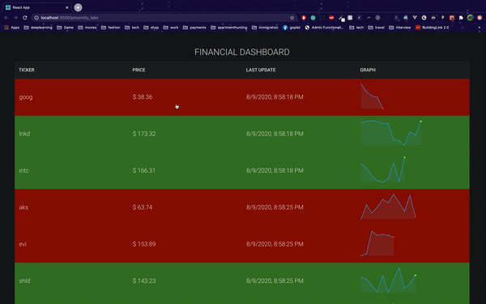

## A demo application built in React.

Deployed here: https://bhimeshchauhan.github.io/proximity_labs/

What it does: Show real time stock market data in the form of table and graphs

Subscribes to a Websocket(ws://stocks.mnet.website/) to fetch simulated stock market data.

## Features
  - A table showing data for all the stocks
  - Each row shows:
    - The latest stock price. (With color relative to the previous stock value)
    - A sparkline showing the changes in stock values (Without considering the time factor)
    - When was the specific stock last updated
  
## Issues

> The connection is not secure so cannot be served live yet to ws over an https network. can be served via heroku or AWS

## GIF
